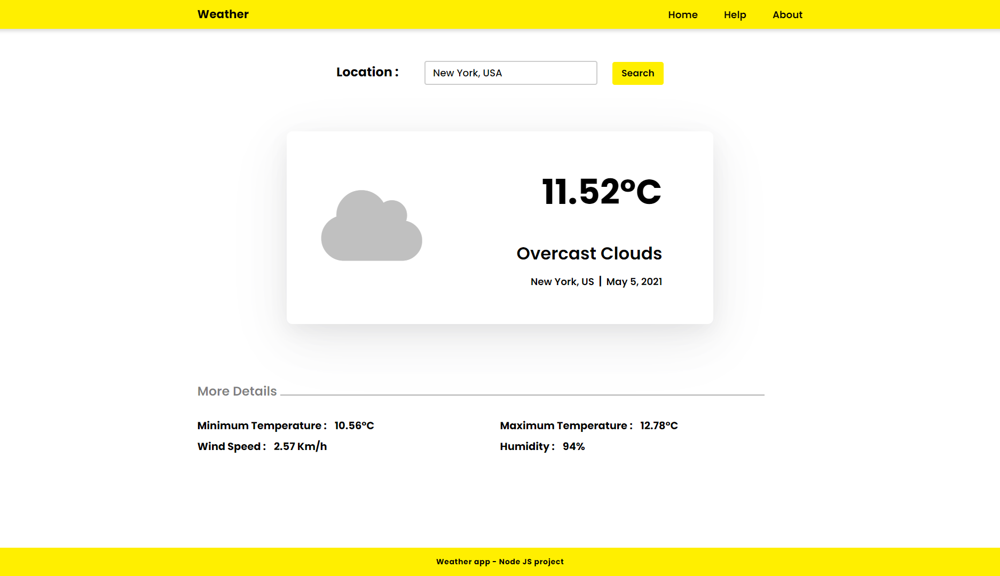

# weather-website
##### Node JS and Express JS project

 
https://skr-weather-app.herokuapp.com/

 
 
 

 

#### Weather app shows you the weather of the given location. 
It uses Node JS and Express JS in the backend and simple HTML and CSS in the frontend. It uses MapBox API to find the coordinates of the given location and OpenWeather API to get the weather for the coordinates of the location.

 

### Features of this project :-
<ol>
  <li>Asynchronous</li>
  <li>Promises, async and await</li>
  <li>Express JS and web server</li>
  <li>Working with API</li>
  <li>OpenWeather API and MapBox API</li>
  <li>Handlebars, axios and dotenv</li>
  <li>Dynamic and Static Pages</li>
  <li>Templating and View Engine</li>
  <li>Error Handling</li>
</ol>
