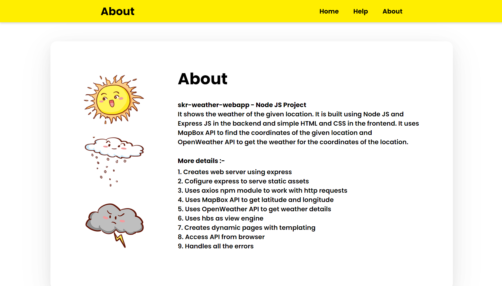
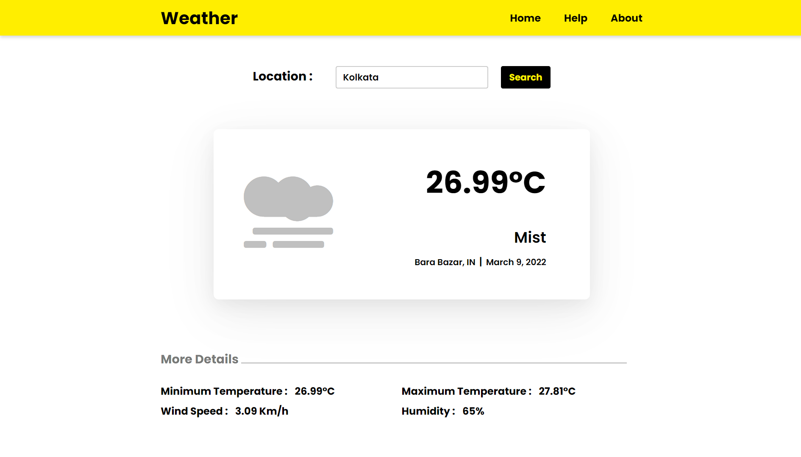
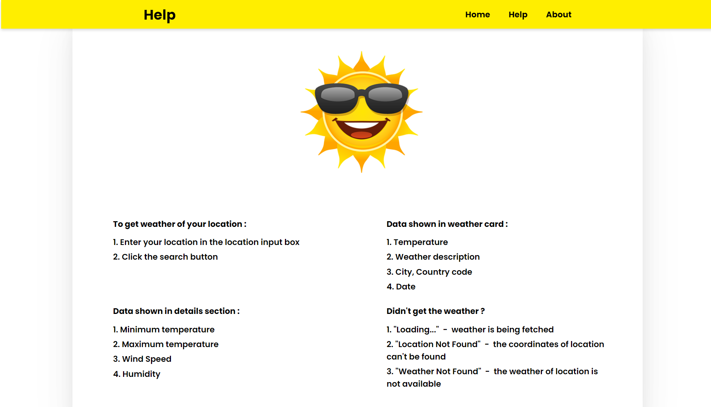

# skr-weather-webapp
##### Node.js and Express project

 
 

<strong>Link :-  </strong>  <i> https://skr-weather-app.herokuapp.com/ </i>

 

 

skr-weather-webapp is a weather application that shows the weather of the given location. It is built using Node JS and Express JS in the backend and simple HTML and CSS in the frontend. It uses MapBox&nbsp;API to find the coordinates of the given location and OpenWeather&nbsp;API to get the weather for the coordinates of the location.

 

### Features
<ol>
<li>Creates web server using express</li>
<li>Cofigure express to serve static assets</li>
<li>Uses axios npm module to work with http requests</li>
<li>Uses MapBox API to get latitude and longitude</li>
<li>Uses OpenWeather API to get weather details</li>
<li>Uses hbs as view engine</li>
<li>Creates dynamic pages with templating</li>
<li>Access API from browser</li> 
<li>Handles all the errors</li>
</ol>

 

 

### To get weather of your location
<ol>
  <li>Enter your location in the location input box</li>
  <li>Click the search button</li>
</ol>

 

 

### Data shown in weather card
<ol>
  <li>Temperature</li>
  <li>Weather description</li>
  <li>City, Country code</li>
  <li>Date (Month DD, YYYY)</li>
</ol>

 

### Data shown in details section
<ol>
  <li>Minimum temperature</li>
  <li>Maximum temperature</li>
  <li>Wind Speed</li>
  <li>Humidity</li>
</ol>

 

### Didn't get the weather ?
<ol>
  <li>"Loading..." &nbsp;-&nbsp; weather is being fetched</li>
  <li>"Loading..." &nbsp;-&nbsp; weather is being fetched means the coordinates of your location can't be found</li>
  <li>"Weather Not Found" &nbsp;-&nbsp; means the weather of location is not available</li>
</ol>

 

 
